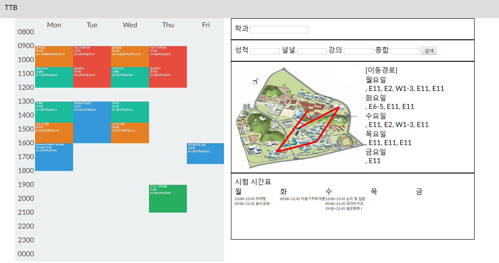

# TTB - Terrible Time Table generator

OTL 평가를 기반으로 만들 수 있는 최악의 시간표를 만들어보자!

@[kook](https://github.com/team-kook) 무쓸모톤

## 구성

1. OTL parser
2. 시간표 생성
3. 시간표 띄우기

## OTL parser

Written in Python

thanks to [OTL](otl.kaist.ac.kr)

학교 홈페이지에서 다운받은 전체개설교과목 엑셀 파일을 바탕으로 beautifulsoup를 이용하여 otl.kaist.ac.kr 에 request를 보내서 각 과목별로 review 데이터를 수집한다. review가 없는 경우에는 ?로 남겨둠

## 시간표 생성

## 시간표 띄우기

Written in HTML/CSS, Javascript

thanks to [Li Kai](https://codepen.io/likai/pen/NrqXLm)

시간표 템플릿은 위의 코드를 이용하였다.
학과와 리뷰의 가중치를 포함하여 서버에 request를 보내고 시간표를 받는다.
서버로부터 받은 response를 가지고 시간표를 띄운다.

## 스크린샷

## 작성자

- [권기훈](https://github.com/KwonKyoon)
- [황민영](https://github.com/Daniel-H-99)
